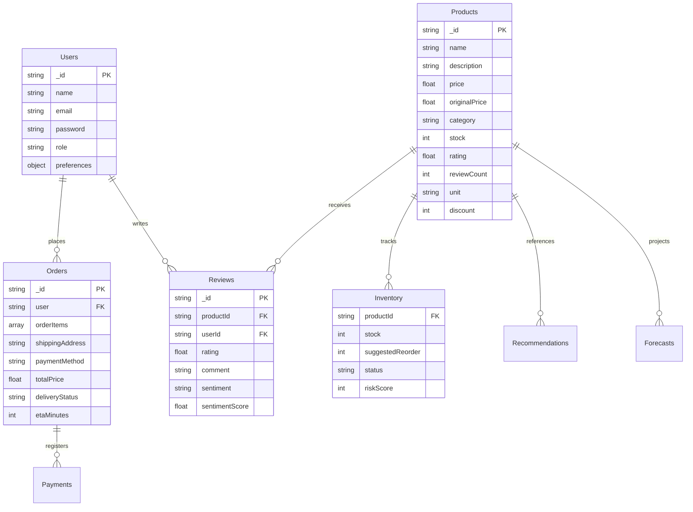

# ZippyMart: AI-Powered Grocery Delivery Platform ⚡

ZippyMart is a production-grade, full-stack grocery delivery system inspired by **Zepto** and **Blinkit**, built to demonstrate clean architectural designs and high-fidelity integrations of **Data Science** and **Machine Learning** with full-stack web applications.

This repository features **7 AI/ML engines** (FastAPI) linked dynamically to a JWT-secured **Express REST API** and a stunning, **dark-glassmorphism React** interface.

---

## 🛠️ Technology Stack

* **Frontend**: React.js, Vite, Tailwind CSS, Redux Toolkit, Axios, Recharts
* **Backend**: Node.js, Express.js, JWT Authentication, Local persistent JSON DB / Mongoose MongoDB Atlas Connector, simulated Razorpay gateways
* **AI/ML Service**: FastAPI, Scikit-Learn, Pandas, NumPy, Python-based text sentiment parsers, Linear-Trend regression forecasters, and K-Means segmentation clusters

---

## 🧬 System Architecture Diagram

```
                              ┌────────────────────────────────┐
                              │     React.js Frontend App      │
                              │       (Port: 3000, Vite)       │
                              └───────┬────────────────┬───────┘
                                      │                │
                        REST APIs /   │                │   FastAPI Chat /
                        JWT Secured   │                │   ML Predictions
                                      ▼                ▼
                     ┌──────────────────┐    CORS    ┌──────────────────┐
                     │ Express Backend  │───────────▶│ FastAPI Service  │
                     │  (Port: 5000)    │◀───────────│  (Port: 8000)    │
                     └────────┬─────────┘  REST Events└──────────────────┘
                              │
                    Dual Mode │ (Mongoose / Persistent Local File)
                              ▼
                     ┌──────────────────┐
                     │  MongoDB Atlas   │
                     │  / Local JSON    │
                     └──────────────────┘
```

---

## 📊 Database Entity-Relationship (ER) Diagram



---

## 📂 Codebase Directory Layout

```
grocery-delivery-platform/
├── backend/                  # Node.js Express REST API
│   ├── config/               # Database connectors (MongoDB / Local)
│   ├── controllers/          # Controllers (Auth, Products, Orders, Admin)
│   ├── data/                 # Persistent local JSON data files
│   ├── middleware/           # JWT & Admin protection layers
│   ├── routes/               # Express endpoints routes
│   └── scripts/              # Initial catalog seeding scripts
├── frontend/                 # React SPA
│   ├── src/
│   │   ├── pages/            # Views (Catalog, Detail, Cart, Tracking, Admin)
│   │   ├── store/            # Redux Slices (Auth, Cart, Catalog, Orders, ML)
│   │   ├── main.jsx          # React mount entry
│   │   └── index.css         # Styling, scrollbars, and animations
│   ├── tailwind.config.js    # Glassmorphism layouts declaration
│   └── vite.config.js        # Uvicorn proxy config
├── ml_service/               # FastAPI Python Intelligence Layer
│   ├── app/
│   │   ├── models/           # Data Science Engines
│   │   │   ├── recommender.py  # Content-based & Collaborative matrices
│   │   │   ├── forecaster.py   # Demand forecasters
│   │   │   ├── segmentation.py # K-Means cluster classifiers
│   │   │   ├── sentiment.py    # Linguistic NLP feedback analyzer
│   │   │   ├── pricing_engine.py # Dynamic discount regulations
│   │   │   └── chatbot.py      # Regex & semantic kitchen assistant
│   │   └── main.py           # FastAPI entrypoint routing
│   └── requirements.txt      # Scikit-learn, pandas packages
└── package.json              # Global runner configurations
```

---

## 🧠 Dynamic AI & Machine Learning Services

ZippyMart executes **7 advanced analytical engines** in Python:

1. **Product Recommendation System (`recommender.py`)**:
   * *Content-Based Similarity*: Fits a Scikit-Learn `TfidfVectorizer` to product metadata (category, names, descriptions), generating a sparse term-frequency cosine similarity matrix to recommend similar products.
   * *Collaborative Filtering*: Constructs a live utility rating matrix from transaction logs, using cosine user-item interactions to predict personalized items.
   
2. **Demand Forecasting (`forecaster.py`)**:
   * Captures dates from sales event logs, grouping quantities by product and category over time.
   * Fits a `LinearRegression` trend lines for active products, applying day-of-week seasonality weight variables to estimate future demand values.

3. **Smart Inventory Prediction (`forecaster.py`)**:
   * Evaluates remaining stock weights against projected weekly demand ratios, computing real-time out-of-stock risk metrics and suggested reorder supplies.

4. **Interactive Grocery Assistant Chatbot (`chatbot.py`)**:
   * A localized conversational assistant matching search patterns, receipts tracking, recipe recommendations, and FAQs, with direct fallbacks to uvicorn API connections.

5. **Customer Segmentation (`segmentation.py`)**:
   * Collects shopper records: `totalSpent`, `orderCount`, `avgOrderValue`, and `premiumRatio`.
   * Standardizes parameters using Scikit-Learn `StandardScaler` and groups shoppers into 4 profiles (Premium, Budget, Frequent, Occasional) using **K-Means Clustering**.

6. **Feedback Sentiment Analysis (`sentiment.py`)**:
   * An NLP linguistic matching engine mapping polarity weights, handling intensifiers ("very", "extremely") and negations ("not", "no") to score product review sentiment on a Sigmoid-normalized `[-1.0, 1.0]` bound.

7. **Dynamic Pricing Engine (`pricing_engine.py`)**:
   * Optimizes pricing in response to remaining inventory ratios. Applies up to an 8% scarcity markup in high-demand/low-supply scenarios, and up to an 18% overstock clearance discount for high supply ratios.

---

## 🔌 API Route Reference Documentation

### Authentication (`/api/auth`)
* `POST /register` - Formulates user credentials.
* `POST /login` - Signs in user and returns a JWT token.
* `POST /reset-password` - Resets passwords.
* `GET /profile` (Protected) - Reads current account details.

### Catalog (`/api/products`)
* `GET /` - Fetches products based on search query, category filters, and sorting.
* `GET /:id` - Resolves product info, NLP reviews, and triggers FastAPI recommendations.
* `POST /:id/reviews` (Protected) - Submits review comments and runs real-time sentiment analysis.

### Order Processing (`/api/orders`)
* `POST /` (Protected) - Performs cart checkouts, reduces stock, and notifies ML service.
* `GET /myorders` (Protected) - Lists order receipts.
* `GET /:id` (Protected) - Live vehicle tracking and ETA increments.

### Admin Intelligence (`/api/admin`)
* `GET /analytics` (Protected + Admin) - Total revenues and product performance stats.
* `GET /inventory` (Protected + Admin) - Stock tables, risk rankings, and restock prompts.
* `GET /ml-insights` (Protected + Admin) - K-Means clusters and weekly demand forecasts.

---

## 🚀 Quick Start Local Deployment Guide

### Prerequisites
1. **Node.js** (v16+) installed.
2. **Python** (3.8+) with pip installed.

### Step 1: Install Dependencies
Open your shell terminal in the project directory:
```bash
# Install root package, backend Express, and React frontend dependencies
npm run install:all
```

### Step 2: Set Environment Variables (Optional)
Create `.env` inside `backend/` if you want MongoDB Atlas cloud DB:
```env
MONGO_URI=your_mongodb_atlas_connection_string
JWT_SECRET=premium_groceries_super_secret_key
PORT=5000
```
*If no MONGO_URI is declared, the backend operates in local JSON file persistence mode automatically!*

### Step 3: Set Python Environment
Open a terminal in `ml_service/`:
```bash
# Create python virtual environment
python -m venv venv
# Activate virtual environment (Windows Powershell)
.\venv\Scripts\Activate.ps1
# Install packages
pip install -r requirements.txt
```

### Step 4: Run Services
Start Node server, Vite React client, and FastAPI ML service simultaneously:
```bash
# From the root directory:
npm run dev
```

The system launches:
* **Frontend**: `http://localhost:3000`
* **Express Backend**: `http://localhost:5000`
* **FastAPI ML Service**: `http://127.0.0.1:8000`

### 🔑 Sandbox Default Logins
* **User**: `user@grocery.com` / `user123`
* **Admin**: `admin@grocery.com` / `admin123`
